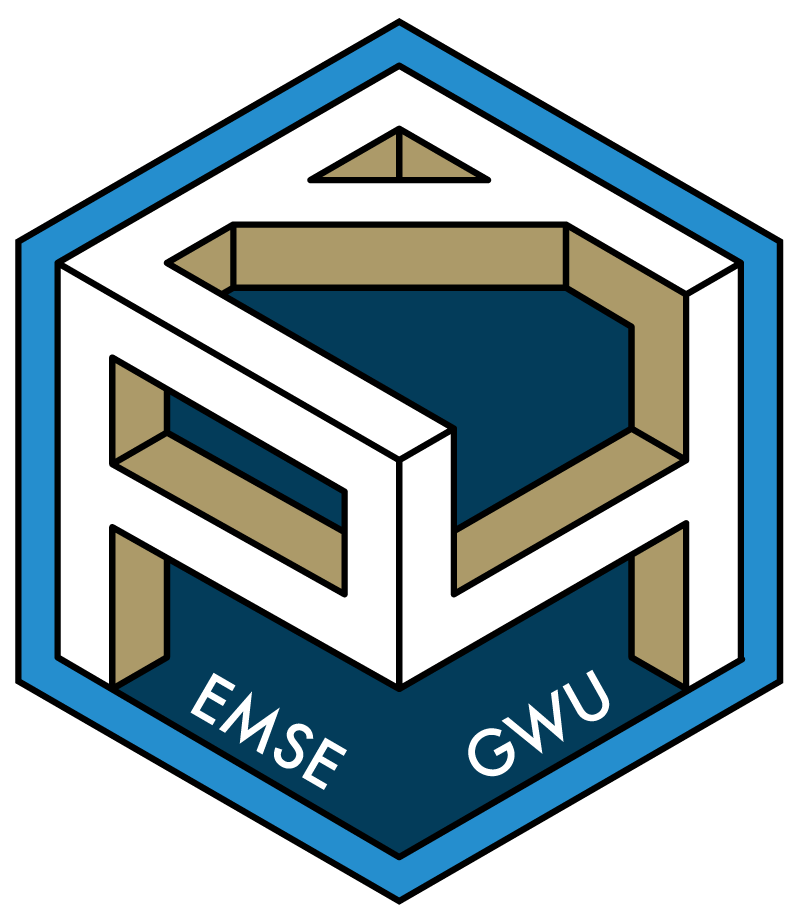

```{r setup, include=FALSE}
knitr::opts_chunk$set(
  warning = FALSE,
  message = FALSE,
  comment = "#>",
  fig.retina = 3,
  fig.path = "figs/"
)

library(tidyverse)
library(here)
bears <- read_csv(here::here('data', 'bear_killings.csv'))
birds <- read_csv(here::here('data', 'wildlife_impacts.csv'))
```

```{python}
'In Python, you can concatenate strings' + ' like this!'
```


# R Markdown

This is an R Markdown document. Markdown is a simple formatting syntax for authoring HTML, PDF, and MS Word documents. For more details on using R Markdown see [rmarkdown.rstudio.com](http://rmarkdown.rstudio.com).

When you click the **Knit** button a document will be generated that includes both content as well as the output of any embedded R code chunks within the document.

## Useful tools

- Quick markdown reference guide: [https://commonmark.org/help/](https://commonmark.org/help/)
- Quick demo guide: [https://markdown-it.github.io/](https://markdown-it.github.io/).
- Online table converter: [http://www.tablesgenerator.com](http://www.tablesgenerator.com/markdown_tables)

## Link to data source of final practice today

https://github.com/rfordatascience/tidytuesday/tree/master/data/2018/2018-10-16

# Plots

## Using ggplot

Here is an example of how to make a plot with ggplot2:

```{r}
bears %>%
  count(month) %>%
  ggplot() +
  geom_col(aes(x = as.factor(month), y = n)) +
  theme_minimal(base_size = 22) + 
  labs(x = "Month", y = "Count")
```

Including an image:

```{r, echo=FALSE, out.width="20%", fig.align='center'}

```

