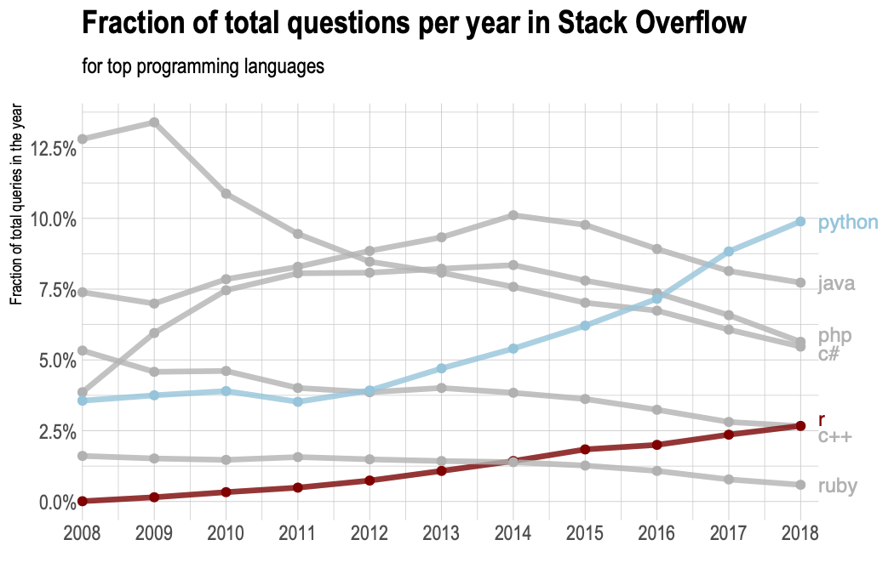

```{r, child="../setup.Rmd"}
```

---

class: inverse

# Quiz 5

```{r, echo=FALSE}
countdown(
  minutes      = 5,
  warn_when    = 30,
  update_every = 1,
  top          = 0,
  right        = 0,
  font_size    = '3em'
)
```

.leftcol[
## Go to `#class` channel in Slack for quiz link

## Open RStudio first!

## Rules:

- You may use your notes and RStudio
- You may **not** use any other resources (e.g. the internet, your classmates, etc.)
]

.rightcol[
<br>
<center>

</center>
]

---

class: center, middle, inverse

# .fancy[R tip of the week]: 

# `styler`

---

# Install `styler` package

<br>

```{r, eval=FALSE}
install.packages("styler")
```

<br>

Go to .red[Addins] menu, search for .red["style"], select .red["Style active file"]

---

```{r child="topics/0.Rmd"}
```

---

```{r child="topics/1.Rmd"}
```

---

class: center, middle

## Why Python?

<center>

</center>

<!-- https://towardsdatascience.com/predicting-the-future-popularity-of-programming-languages-4f28c80bd36f -->

[image source](https://insights.stackoverflow.com/trends?tags=r%2Cpython%2Cjava%2Cphp%2Cc%23%2Cc%2B%2B%2Cruby)

---

class: center, middle

.leftcol[

# .center[`r fontawesome::fa("python", fill = "black")`]

<center>

</center>

]

.rightcol[

# .center[`r fontawesome::fa("r-project", fill = "black")`]

<center>

</center>

]

---

.code90[

## Install the `reticulate` library

```{r, eval=FALSE}
install.packages("reticulate")
```

(Only do this once)

]

--

<br>

.code90[

## Load the `reticulate` library

```{r, eval=FALSE}
library(reticulate)
```

(Do this every time you use the package)

]

---

## Do you have Python on your computer?

If note, you may see the following message pop up:

```{r, eval=FALSE}
Would you like to install Miniconda? [Y/n]:
```

My recommendation: type `y` and press `enter`

---

## Starting Python

Open a Python REPL ("**R**ead–**E**val–**P**rint-**L**oop"):

```{r, eval=FALSE}
repl_python()
```

--

You should see the `>>>` symbol in the console. This means you're now using Python!

(Remember, the R console has only one `>` symbol).


--

**You want to use Python 3, not Python 2**

Above the `>>>` symbols, it should say `"Python 3...."`

---

## Exiting Python (but we just got started?)

If you want to get back to good 'ol R, just type the command `exit` into the Python console:

```{r, eval=FALSE}
exit
```

(Note that you type `exit` and not `exit()` with parentheses).

---

# Open a Python script

> File --> New File --> Python Script

--

<br>

When you run code from a Python script, R automatically opens a Python REPL


---

```{r child="topics/2.Rmd"}
```

---

# Operators

```{css, echo=F}
    .remark-slide table{
        width: 100%;
    }
```

--

.leftcol[.left[

## Arithmetic operators

Operator | R      | Python
-----------------|---------|-----------
Integer division |  `%/%` | `//`
Modulus          |  `%%`  | `%`
Powers           |  `^`   | `**`

]]

--

.rightcol[.left[

## Logical operators

Operator  | R         | Python
----------|-----------|-----------
And       |  `&`      | `and`; `&`
Or        |  &#124;   | `or`; &#124;
Not       |  `!`      | `not`; `!`

You can do this in Python:

```{python}
(3 == 3) and (4 == 4)
```

]]

---

## Variable assignment

Python only uses the `=` symbol to make assignments (no `<-`):

```{python}
value = 3
value
```

---

## Data types

Same data types as R, but with more "Computer Science-y" names:

.leftcol60[.left[

Description          | R            | Python
---------------------|--------------|-----------
numeric (w/decimal)  | `double`   | `float`
integer              | `integer`  | `int`
character            | `character`| `str`
logical              | `logical`  | `bool`

]]

---

## Data types

Three important distinctions:

.left[

Data type     | R                  | Python
--------------|--------------------|-----------
Logical       | `TRUE` or `FALSE` | `True` or `False`
Numbers       | `double` by default  | `int` by default (unless has decimal)
Nothing       | `NULL`| `None`

]

---

.center[**Get type**]

.leftcol[

.center[**R**: `typeof()`]

```{r}
typeof(3.14)
```

```{r}
typeof(3L)
```

```{r}
typeof("3")
```

```{r}
typeof(TRUE)
```

]

.rightcol[

.center[**Python**: `type()`]

```{python}
type(3.14)
```

```{python}
type(3)
```

```{python}
type("3")
```

```{python}
type(True)
```

]

---

.center[**Check type**]

.leftcol[

.center[**R**: `is.______()`]

```{r}
is.double(3.14)
```

```{r}
is.integer(3L)
```

```{r}
is.character("3")
```

```{r}
is.logical(TRUE)
```

]

.rightcol[

.center[**Python**: `type() == type`]

```{python}
type(3.14) == float
```

```{python}
type(3) == int
```

```{python}
type("3") == str
```

```{python}
type(True) == bool
```

]

---

.center[**Convert type**]

.leftcol[

.center[**R**: `as.______()`]

```{r}
as.double("3")
```

```{r}
as.integer(3.14)
```

```{r}
as.character(3.14)
```

```{r}
as.logical(3.14)
```

]

.rightcol[

.center[**Python**: `______()`]

```{python}
float("3")
```

```{python}
int(3.14)
```

```{python}
str(3.14)
```

```{python}
bool(3.14)
```

]

---

## Quick practice

```{r, echo=FALSE}
countdown(
  minutes      = 2,
  warn_when    = 30,
  update_every = 1,
  top          = 0,
  right        = 0,
  font_size    = '2em'
)
```

Write Python code to do the following:

1. Create an object `x` that stores the value `"123"`
2. Create an object `y` that is `x` converted to an integer
3. Write code to confirm that `y` is indeed an integer
4. Write a logical statement to determine if `y` is odd or even

---

```{r child="topics/3.Rmd"}
```

---

# Python and R have many similar functions

--

.leftcol[

.center[**R**]

```{r}
abs(-1)
round(3.14)
round(3.14, 1)
```

]

.rightcol[

.center[**Python**]

```{python}
abs(-1)
round(3.14)
round(3.14, 1)
```

]

---

# Writing functions

.leftcol[

.center[**R**]

```{r}
isEven <- function(n) {
    if (n %% 2 == 0) {
        return(TRUE)
    }
    return(FALSE)
}
```

]

--

.rightcol[

.center[**Python**]

```{python}
def isEven(n):
    if (n % 2 == 0):
        return(True)
    return(False)
```

Note:

- Functions start with `def`
- Use `:` and indentation instead of `{}`
- **Indentation is precisely 4 spaces!**

]

---

# Writing test functions

.leftcol[

.center[**R**]

```{r}
test_isEven <- function() {
    cat("Testing isEven(n)...")
    stopifnot(isEven(2) == TRUE)
    stopifnot(isEven(1) == FALSE)
    cat("Passed!")
}
```

]

--

.rightcol[

.center[**Python**]

```{python}
def test_isEven():
    print("Testing isEven(n)...")
    assert(isEven(2) == True)
    assert(isEven(1) == False)
    print("Passed!")
```

Note:

- Use `print()` instead of `cat()`
- Use `assert()` instead of `stopifnot()`

]

---

# Python Methods

Python objects have "methods" - special functions that _belong_ to certain object classes.

--

Example: Make a string upper case

.leftcol[

.center[**R**]

Use `str_to_upper()` function

```{r}
s <- "foo"
stringr::str_to_upper(s)
```

]

--

.rightcol[

.center[**Python**]

Use `upper()` _method_

```{python}
s = "foo"
s.upper()
```

]

---

# Python Methods

See all the available methods with `dir` function:

```{python}
s = "foo"
dir(s)
```

---

class: inverse, middle, center

# R-Python magic

---

# R-Python magic

You can source a Python script from R, then use the Python function in R!

--

Inside your `notes-blank.py` file, you have the following function defined:

```{python}
def isEven(n):
    if (n % 2 == 0):
        return(True)
    return(False)
```

--

Open your `notes.R` file and _source_ the `notes-blank.py` file:

```{r, eval=FALSE}
reticulate::source_python('notes-blank.py')
```

--

Magically, the function `isEven(n)` now works inside R!

---

class: inverse

```{r, echo=FALSE}
countdown(
  minutes      = 15,
  warn_when    = 30,
  update_every = 1,
  top          = 0,
  right        = 0,
  font_size    = '2em'
)
```

# Your turn

Write the following two functions in Python code:

1. `hypotenuse(a, b)`: Returns the hypotenuse of the two lines of length `a` and `b`.

2. `isRightTriangle(a, b, c)`: Returns `True` if the triangle formed by the lines of length `a`, `b`, and `c` is a right triangle and `False` otherwise. **Hint**: you may not know which value (`a`, `b`, or `c`) is the hypotenuse.

```{python, echo=FALSE}
def hypotenuse(a, b):
    return((a**2 + b**2)**0.5)

def isRightTriangle(a, b, c):
    test1 = (c == hypotenuse(a, b))
    test2 = (b == hypotenuse(a, c))
    test3 = (a == hypotenuse(b, c))
    return(test1 or test2 or test3)
```

---

```{r child="topics/4.Rmd"}
```

---

## `for` loops

.leftcol[

.center[**R**]

```{r}
for (i in seq(1, 5, 2)) {
    cat(i, '\n')
}
```

]

--

.rightcol[

.center[**Python**]

```{python}
for i in range(1, 5, 2):
    print(i)
```

Notes:

- `range()` leaves out stopping number
- No `()` in `for` loop line

]

---

## `while` loops

.leftcol[

.center[**R**]

```{r}
i <- 1
while (i <= 5) {
    print(i)
    i <- i + 2
}
```

]

--

.rightcol[

.center[**Python**]

```{python}
i = 1
while i <= 5:
    print(i)
    i += 2
```

Notes:

- Could also use `i = i + 2` to increment
- No `()` in `while` loop line

]

---

# Python lists

These are **not** the same as R vectors! (They're equivalent to R lists)

--

Universal list creator: `[]`

```{python}
[1, 2, 3]
```

--

Lists can store different types

```{python}
[1, "foo", True]
```

---

## Adding and removing items

--

.leftcol[

Add items with `list.append()`

```{python}
x = [1, 2, 3]
x.append(7)
x
```

**Note**: You don't have to overright `a`,<br>
i.e. Don't do this: `x = x.append(7)`

]

--

.rightcol[

Remove items with `list.remove()`

```{python}
x = [1, 2, 3]
x.remove(3)
x
```

]

---

## Sorting lists

```{python}
x = [1, 5, 3]
```

--

.leftcol[

Sorting that returns a new object

```{python}
sorted(x)
sorted(x, reverse = True)
x
```

]

--

.rightcol[

Sort the object `x` _without_ creating a new object

```{python}
x.sort()
x
```

]

---

# Slicing lists with `[]`

```{python}
x = ['A', 'list', 'of', 'words']
```

--

.leftcol[.code80[

Indices start at 0:

```{python}
x[0] # Returns the first element
```

```{python}
x[3] # Returns the third element
```

```{python}
x[len(x)-1] # Returns the last element
```

]]

--

.rightcol[.code80[

Slicing with a vector of indices:

```{python}
x[0:3]  # Returns the first 3 elements
```

]]

---

# Negative indices slice from the end

```{python}
x = ['A', 'list', 'of', 'words']
```

--

.leftcol[.code80[

Indices start at 0:

```{python}
x[-1] # Returns the last element
```

```{python}
x[-2] # Returns 2nd-to-last element
```

```{python}
x[-len(x)] # Returns first element
```

]]

--

.rightcol[.code80[

Slicing with a vector of indices:

```{python}
x[-3:-1]  # Returns middle 2 elements
```

]]

---

## Note on 0 indexing

```{python}
x = ["A", "B", "C", "D", "E"]
```

--

List items sit _between_ fence posts.

```{python, eval=FALSE}
index: 0     1     2     3     4
       |     |     |     |     |     |
item:  | "A" | "B" | "C" | "D" | "E" |
       |     |     |     |     |     |
```

--

You slice at the _fence post_ number to get elements _between_ the posts.

.leftcol[

```{python}
x[0:1]
```

]

.rightcol[

```{python}
x[0:3]
```

]

---

class: inverse

```{r, echo=FALSE}
countdown(
  minutes      = 15,
  warn_when    = 30,
  update_every = 1,
  top          = 0,
  right        = 0,
  font_size    = '2em'
)
```

# Your turn

Write the following two functions in Python code:

1. `factorial(n)`: Returns the factorial of `n`, e.g. `3! = 3*2*1 = 6`. Note that `0` is a special case, and `0! = 1`. Assume `n >= 0`.

2. `nthHighestValue(n, x)`: Returns the nth highest value in a list of numbers. For example, if `x = [5, 1, 3]`, then `nthHighestValue(1, x)` should return `5`, because `5` is the 1st highest value in `x`, and `nthHighestValue(2, x)` should return `3` because it's the 2nd highest value in `x`. Assume that `n <= len(x)`.

```{python, echo=FALSE}
def factorial(n):
    if (n == 0):
        return(1)
    result = 1
    for i in range(n-1):
        result = result*i
    return(result)

def nthHighestValue(n, x):
    y = sorted(x, reverse = True)
    return(y[n - 1])
```


---

class: inverse, center

# .fancy[Break]

```{r, echo=FALSE}
countdown(
  minutes      = 5,
  warn_when    = 30,
  update_every = 1,
  left         = 0,
  right        = 0,
  top          = 1,
  bottom       = 0,
  margin       = "5%",
  font_size    = "8em"
)
```

---

```{r child="topics/5.Rmd"}
```

---

## Doing "math" with strings

--

.leftcol[

Concatenation:

.center[**R**]

```{r}
paste("foo", "bar", sep = "")
```

]

--

.rightcol[

<br>

.center[**Python**]

```{python}
"foo" + "bar"
```

]

--

.leftcol[

Repetition:

.center[**R**]

```{r}
str_dup("foo", 3)
```

]

--

.rightcol[

<br>

.center[**Python**]

```{python}
"foo" * 3
```

]

---

## Using word commands with strings

.leftcol[

Sub-string detection:

.center[**R**]

```{r}
str_detect('Apple', 'App')
```

]

--

.rightcol[

<br>

.center[**Python**]

```{python}
'App' in 'Apple'
```
]

---

class: inverse, middle, center

## Most string manipulation is done with _methods_

--

.leftcol[

.center[**R**]

```{r, eval=FALSE}
str_function(s)
```

]

--

.rightcol[

.center[**Python**]

```{python, eval=FALSE}
s.method()
```

]

---

## Case conversion

--

.leftcol[

.center[**R**]

```{r}
s <- "A longer string"
str_to_upper(s)
str_to_lower(s)
str_to_title(s)
```

]

--

.rightcol[

.center[**Python**]

```{python}
s = "A longer string"
s.upper()
s.lower()
s.title()
```

]

---

## Trimming white space

--

.leftcol[

.center[**R**]

```{r}
s <- "     A string with space     "
str_trim(s)
```
]

--

.rightcol[

.center[**Python**]

```{python}
s = "     A string with space     "
s.strip()
```

]

---

## Replacing strings

--

.leftcol[

.center[**R**]

```{r}
s <- "Hello world"
str_replace(s, "o", "a")
str_replace_all(s, "o", "a")
```

]

--

.rightcol[

.center[**Python**]

```{python}
s = "Hello world"
s.replace("o", "a")
```

]

---

## Merge a vector / list of strings together

--

.leftcol[

.center[**R**]

```{r}
s <- c("Hello", "world")
paste(s, collapse = "")
```

]

--

.rightcol[

.center[**Python**]

```{python}
s = ["Hello", "world"]
"".join(s)
```

]

---

## Python has some super handy string methods

--

Detect if string contains only numbers:

.leftcol[

.center[**R**]

R doesn't have a function for this...<br>here's one way to do it:

```{r}
s <- "42"
! is.na(as.numeric(s))
```

]

--

.rightcol[

.center[**Python**]

```{python}
s = "42"
s.isnumeric()
```

]

---

## Getting sub-strings with `[]`

--

.leftcol[

.center[**R**]

```{r}
s <- "Apple"
str_sub(s, 1, 3)
```

]

--

.rightcol[

.center[**Python**]

```{python}
s = "Apple"
s[0:3]
```

Notes:

- Indexing is the same as lists

]

---

## Getting sub-string indices

--

.leftcol[

.center[**R**]

```{r}
s <- "Apple"
str_locate(s, "pp")
```

]

--

.rightcol[

.center[**Python**]

```{python}
s = "Apple"
s.index("pp")
```

Note:

- Only returns the starting index

]

---

## String splitting

Both languages return a list:

--

.leftcol[

.center[**R**]

```{r}
s <- "Apple"
str_split(s, "pp")
```

]

--

.rightcol[

.center[**Python**]

```{python}
s = "Apple"
s.split("pp")
```

]

---

## Python can only split individual strings

--

.leftcol[

R can split vectors of strings

```{r}
s <- c("Apple", "Snapple")
str_split(s, "pp")
```

]

--

.rightcol[

.center[**Python**]

```{python, error=TRUE}
s = ["Apple", "Snapple"]
s.split("pp")
```

]

---

## Need **numpy** package for this in Python

```{python}
import numpy as np

s = np.array(["Apple", "Snapple"])
np.char.split(s, "pp")
```

--

<br>

You'll need to install **numpy** to use this:

```{r, eval=FALSE}
py_install("numpy")
```

---

class: inverse

```{r, echo=FALSE}
countdown(
  minutes      = 15,
  warn_when    = 30,
  update_every = 1,
  top          = 0,
  right        = 0,
  font_size    = '2em'
)
```

# Your turn

.font80[

Write the following two functions in Python code:

1. `sortString(s)`: Takes a string `s` and returns back an alphabetically sorted string. **Hint**: Use `list(s)` to break a string into a list of letters.

- `sortString("cba") == "abc"`
- `sortString("abedhg") == "abdegh"`
- `sortString("AbacBc") == "ABabcc"`

2. `areAnagrams(s1, s2)`: Takes two strings, `s1` and `s2`, and returns `True` if the strings are [anagrams](https://en.wikipedia.org/wiki/Anagram), and `False` otherwise. **Treat lower and upper case as the same letters**.

- `areAnagrams("", "") == True`
- `areAnagrams("aabbccdd", "bbccddee") == False`
- `areAnagrams("TomMarvoloRiddle", "IAmLordVoldemort") == True`
]

```{python, echo=FALSE, eval = FALSE}
def sortString(s):
    chars = sorted(s)
    return("".join(chars))

def areAnagrams(s1, s2):
    s1 = s1.lower()
    s2 = s2.lower()
    return(sortString(s1) == sortString(s2))
```

---

# [HW 8](https://p4a.seas.gwu.edu/2022-Spring/hw8-python.html)

I suggest starting with `reticulate::repl_python()` to work in Python from RStudio.

--

- Submit your "hw8.py" file to the autograder - it will (hopefully) work
