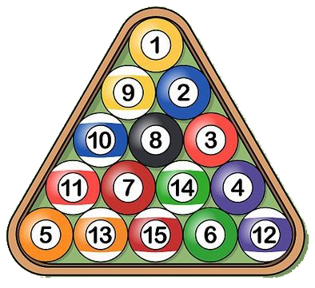

```{r child = file.path("child", "setup.Rmd")}
```

```{r child = file.path("child", "hw.Rmd")}
```

### 1) Staying organized [SOLO, 5%]

As always, we're going to use an R project to keep everything in this assignment tidy. Download and use [this template](templates/hw3.zip) for your assignment. Inside the "hw3" folder, open and edit the R script called "hw3.R" and fill out your name, Net ID, and the names of anyone you worked with on this assignment.

### 2) `integerSquareRoot(n)` [SOLO, 10%]

Given a non-negative integer `n`, return the integer value that is closest to its square root. For example, `integerSquareRoot(10)` returns `3`.

### 3) `fabricYards(inches)` [SOLO, 10%]

Fabric must be purchased in whole yards. Write a function that takes a non-negative number of inches of fabric desired, and returns the smallest number of whole yards of fabric that must be purchased.  Thus, `fabricYards(1)` is `1` (you need a full yard if you buy one inch) and `fabricYards(36)` is also `1`, but `fabricYards(37)` is `2`. Hint: There are 36 inches in a yard!

### 4) `fabricExcess(inches)` [SOLO, 10%]

Write a function that takes a non-negative number of inches of fabric desired and returns the number of inches of excess fabric that must be purchased (as purchases must be in whole yards). Thus, since you need a whole yard when you buy 1 inch, `fabricExcess(1)` is `35`. Similarly, `fabricExcess(36)` is `0`, and `fabricExcess(37)` is `35`.

Hint: there are (at least) two good ways to write this. One way involves a simple expression using one of the math operators we have learned. The other way uses `fabricYards(inches)` (which you just wrote!).

### 5) `isPerfectCube(x)` [SOLO, 15%]

Given an integer value `x`, returns `TRUE` if it is a perfect cube and `FALSE` otherwise. That is, return `TRUE` if there is another integer `y` such that `x = y^3`. Thus, `isPerfectCube(27)` returns `TRUE`, but `isPerfectCube(16)` returns `FALSE`.

### 6) `kthDigit(x, k)` [COLLABORATIVE, 15%]

Given two integers, `x` and `k`, return the kth digit of `x`, counting from the right. So:

- `kthDigit(789, 1)` returns `9`
- `kthDigit(789, 2)` returns `8`
- `kthDigit(789, 3)` returns `7`
- `kthDigit(789, 4)` returns `0`

Negative numbers should work, too, so `kthDigit(-789, 1)` returns `9`.

### 7) `numberOfPoolBalls(rows)` [COLLABORATIVE, 15%]

{ width=150 }

Pool balls are arranged in rows where the first row contains 1 pool ball and each row contains 1 more pool ball than the previous row. Thus, for example, 3 rows contain 6 total pool balls (1+2+3). With this in mind, write the function `numberOfPoolBalls(rows)` that takes a non-negative integer value (the number of rows) and returns another integer value (the number of pool balls in that number of full rows). For example, `numberOfPoolBalls(3)` returns `6`. We will not limit our analysis to a "rack" of 15 balls; rather, our pool table can contain an unlimited number of rows. Hint: For this problem you should research [Triangular Numbers](https://en.wikipedia.org/wiki/Triangular_number).

### 8) `turtleSquare(s)` [COLLABORATIVE, 10%]

(_Note: the autograder won't test this function_)

Write the function `turtleSquare(s)` which uses the **TurtleGraphics** package to draw a square with side length `s < 100` (because the turtle will "escape" the terrarium when `s >= 100`). The square should be centered in the turtle's terrarium, and your turtle should be placed in the center when done. **Important**: Do not put the `turtle_init()` command inside your function - the turtle should already be "initialized" inside the terrarium before calling your `turtleSquare(s)` function. For example, the code below produces a square with side length of 50:

```{r, eval=FALSE}
library(TurtleGraphics)
turtle_init()
turtleSquare(50)
```
{ width=456 }

### 9) Read and reflect [SOLO, 10%]

Read and reflect on next week's readings on [conditionals](r4.1-conditionals.html) and [testing & debugging](r4.2-testing-debugging.html). Afterwards, in a comment (`#`) in your R file, write a short reflection on what you've learned and any questions or points of confusion you have about what we've covered thus far. This can just few a few sentences related to this assignment, next week's readings, things going on in the world that remind you something from class, etc. If there's anything that jumped out at you, write it down.

---

### **Bonus**: `turtleTriangle(s)` [SOLO, 3%]

(_Note: the autograder won't test this function_)

Write the function `turtleTriangle(s)` which uses the **TurtleGraphics** package to draw an equilateral triangle with side length `s < 100`. The triangle should be centered in the turtle's terrarium, and your turtle should be placed in the center when done. Just like with `turtleSquare(s)`, do not put the `turtle_init()` command inside your function - the turtle should already be "initialized" inside the terrarium before calling `turtleTriangle(s)`. Hint: Getting the triangle centered is the tricky part - you may want to read more about [equilateral triangles](https://en.wikipedia.org/wiki/Equilateral_triangle) and [apothems](https://en.wikipedia.org/wiki/Apothem). The code below produces a triangle with side length of 50:

```{r, eval=FALSE}
library(TurtleGraphics)
turtle_init()
turtleTriangle(50)
```
{ width=456 }
